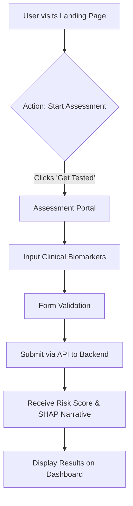
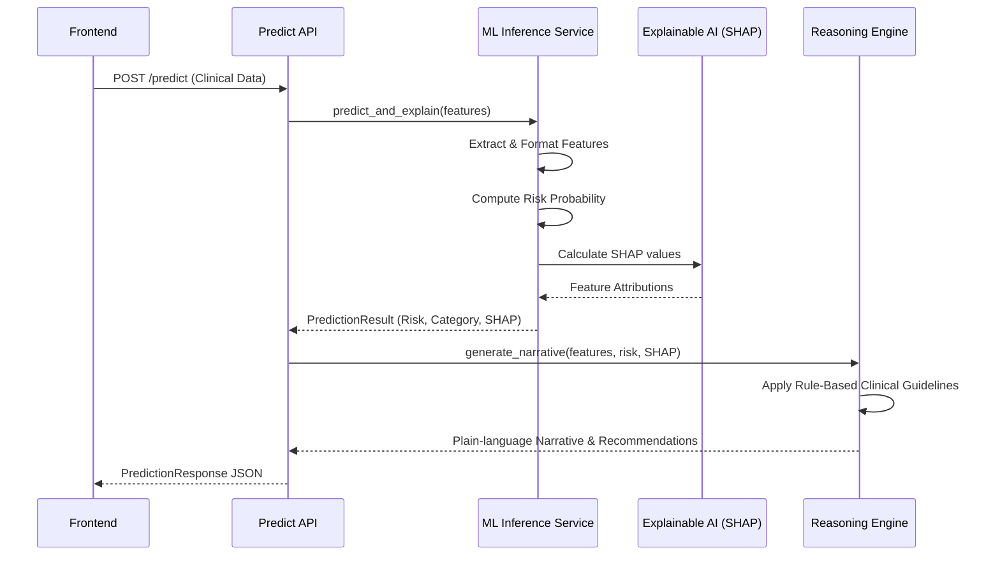

# Chapter 4: System Implementation and Integration

## 4.1 Introduction
This chapter details the implementation of the Prostate Cancer Risk Stratification Clinical Decision Support (CDS) system, designated as **ProsCancX**. The implementation is divided into a modern, responsive frontend built with Next.js and a high-performance backend API powered by FastAPI. The core engine integrates dual machine learning models (XGBoost and Calibrated Logistic Regression) with Explainable AI (SHAP) and a deterministic clinical reasoning engine, specifically calibrated for the Nigerian demographic.

## 4.2 Frontend Implementation and User Flow

The frontend is implemented using a modern React framework (Next.js) with styling powered by Tailwind CSS. The user interface prioritizes clinical efficiency, accessibility, and a premium "geometric" design aesthetic to ensure a seamless experience for both clinicians and patients.

### 4.2.1 Landing Page (`/`)
The landing page serves as the entry point to the application, providing an overview of the system's capabilities, methodology, and evaluated biomarkers. 
- **Header & Navigation:** Includes a sticky navigation bar with a theme toggle and a primary call-to-action (CTA) to initiate the assessment.
- **Hero Section:** Highlights the system's core value proposition—predicting prostate cancer risk using machine learning and clinical indicators. It features a simulated risk assessment interface demonstrating how PSA levels, Age factors, and overall risk scores are visualized dynamically.
- **Clinical Biomarkers:** Educates users on the specific parameters evaluated, such as PSA Density, DRE Clinical Findings, Comorbidities, and Age.

### 4.2.2 Diagnostic Assessment Portal (`/assessment`)
The assessment portal is the core interactive screen where clinical diagnostic parameters are inputted.
- **Diagnostic Engine:** Users input critical biomarkers across a three-step wizard: Age and BMI Category (step 1), Family History and comorbidities — Hypertension and Diabetes Mellitus (step 2), and PSA Level, PSA Density and DRE findings (step 3).
- **Form Component:** Built securely to handle sensitive clinical inputs inspired by HIPAA guidelines. Data is packaged and sent securely to the backend for real-time inference.
- **Result Presentation:** Results render on a fourth step showing the composite risk index, the full Low/Intermediate/High probability distribution, the clinical narrative, guideline-derived recommendations, and the SHAP attribution chart. A dedicated print stylesheet renders this as a self-contained A4 clinical report with an input summary table and a decision-support disclaimer.
- **Failure Handling:** If the API is unreachable or returns an error, the interface remains on the results step and presents the error with Retry and Edit Inputs controls, preserving all entered values.

### 4.2.3 Frontend Integration Flow

## 4.3 Backend Architecture and API Integration

The backend is engineered using **FastAPI** to provide asynchronous, high-performance, and scalable RESTful API endpoints. The architecture emphasizes modularity, separating API routing, machine learning inference, and clinical reasoning into distinct services.

### 4.3.1 Application Initialization and CORS
The main application (`main.py`) handles startup and shutdown events, including initializing database connection pools (Supabase). Cross-Origin Resource Sharing (CORS) is configured to allow secure communication between the frontend and the backend API, ensuring data integrity across distinct origins.

### 4.3.2 Predictive API Endpoint (`/predict`)
The primary endpoint (`api/predict.py`) exposes a POST route that accepts a `ClinicalInput` schema.
1. **Request Handling:** Receives structured JSON containing the patient's diagnostic parameters.
2. **Inference Invocation:** Passes the data to the `ModelInference` service.
3. **Narrative Synthesis:** Feeds the resulting prediction and SHAP values into the `ClinicalReasoningEngine` to generate a plain-language explanation.
4. **Response Generation:** Returns a comprehensive `PredictionResponse` containing the risk category, numerical score, SHAP values, and the clinical narrative.

### 4.3.3 Machine Learning Inference Pipeline
The inference service (`ml/inference.py`) manages a dual-model approach:
- **Primary Model:** A multiclass XGBoost classifier (Low / Intermediate / High) providing robust, non-linear risk stratification.
- **Secondary Model:** A Logistic Regression pipeline wrapped in `CalibratedClassifierCV(method="sigmoid")` — Platt scaling — fitted by cross-validation against the cohort's observed prevalence.
- **SHAP Integration:** Employs TreeSHAP via XGBoost's native `pred_contribs` interface to compute exact feature attributions for the predicted class. This is the same TreeSHAP algorithm as the standalone `shap` package's `TreeExplainer`, implemented inside XGBoost; it is used because `shap` 0.46 cannot parse an XGBoost 3.x multiclass model dump. Attributions are additively exact: contributions plus the bias term reconstruct the raw class margin. The response labels its attribution basis via a `shap_basis` field, since attributions are always computed against the primary tree model.
- **Risk Index:** The headline figure is an expected-severity index, `sum(P(class) x severity)` with severity Low=0, Intermediate=0.5, High=1. A raw `P(High)` or `P(not Low)` was rejected because the classifier saturates near 0/1 on this cohort, making Intermediate and High indistinguishable on a gauge.
- **Failure Semantics:** If model artifacts fail to load, the service raises `ModelsUnavailableError` and the API returns HTTP 503. There is deliberately no numeric fallback — a decision support tool that invents a plausible risk score when its model is missing is more dangerous than one that reports an outage. Artifact status is also exposed on the health endpoint.

### 4.3.4 Clinical Reasoning Engine
The reasoning engine (`services/reasoning.py`) acts as a deterministic safety net. It combines the ML model's output with hardcoded clinical guidelines:
- Synthesizes a narrative detailing the patient's profile (e.g., PSA level, density, DRE findings).
- Applies rule-based logic (e.g., triggering a strong biopsy recommendation if PSA > 10.0 ng/mL or if PSA density > 0.15 within the 4-10 ng/mL grey zone).
- Integrates SHAP values to explicitly state the primary driver of the classification, ensuring the AI remains transparent and interpretable.

### 4.3.5 Backend Prediction Flow

## 4.4 Data Sources and Demographic Calibration

A critical component of this implementation is the sourcing and calibration of the machine learning models. 

### 4.4.1 Model Training and Sourcing
The models are trained locally by `backend/train_models.py` from `prostate_cancer_dataset.csv` and committed as versioned artifacts under `backend/app/ml/artifacts/`:
- `xgboost_model.joblib` — the primary multiclass classifier.
- `logistic_regression_calibrated.joblib` — the Platt-scaled secondary model.
- `metadata.json` — feature order, class order, held-out metrics, and provenance.

Artifacts ship inside the Docker image and are loaded once during the FastAPI lifespan startup. This removes any runtime dependency on an external model registry, so a cold start cannot fail on a network fetch or an expired access token, and the exact weights serving a prediction are the weights recorded in version control.

### 4.4.2 Pre-processing and Demographic Specificity
Feature encoding is defined once in `backend/app/ml/features.py` and imported by both the training script and the inference service, so the two can never drift apart — a training/serving skew of this kind is silent, since the model still returns a confident number for the wrong feature vector. Automated tests assert that the committed artifacts' recorded feature order matches the code.

- Ordinal encodings: BMI (Normal: 0, Overweight: 1, Obese: 2), Age Band (40-49: 0 through 70+: 3), DRE Finding (Normal: 0, Suspicious: 1, Abnormal: 2).
- Ordinal rather than one-hot encoding is used deliberately: it keeps the feature space small relative to 500 training rows and yields one SHAP bar per clinical concept rather than one per category level.
- **Platt Scaling:** The Logistic Regression model incorporates Platt scaling to recalibrate raw scores against the observed prevalence in this cohort, aligning confidence scores with population-specific epidemiology.

### 4.4.3 Evaluation and Limitations

On a stratified 20% hold-out, the XGBoost classifier attains 100% accuracy (macro OvR AUC 1.000) and the Platt-scaled logistic regression attains 91% accuracy (macro OvR AUC 0.982).

**These figures must not be read as clinical predictive performance.** The bundled dataset's `target_risk` labels are reproducible exactly by a depth-3 decision tree, which establishes that the ground truth was generated from a deterministic clinical rule rather than observed patient outcomes. The models are therefore recovering a known rule, and the metrics measure that recovery. The training script detects this condition automatically and records it in `metadata.json` under `labels_are_rule_derived`.

Two further limitations follow from the dataset:
- The `hypertension` and `diabetes` comorbidity features carry no signal in this data — the label-generating rule does not use them — and their SHAP attributions are correspondingly near zero. They are retained as inputs because they are clinically relevant and present in the schema.
- The dataset contains only `Normal` and `Abnormal` DRE findings. The `Suspicious` (induration) option offered in the interface is encoded as an intermediate ordinal value; it is an interpolation on the severity scale, not a level the model has observed in training.

Establishing clinical validity would require retraining and prospective evaluation on a real, outcome-labelled Nigerian cohort with biopsy-confirmed ground truth.

## 4.5 Summary
The implemented system successfully marries an aesthetically intuitive frontend with a robust, AI-powered backend. By integrating XGBoost and Calibrated Logistic Regression with SHAP-based explainability and deterministic clinical reasoning, the system provides transparent, interpretable and clinically actionable risk stratification. Its correctness is guarded by an automated test suite — 30 backend tests covering inference, schema validation, narrative synthesis and training/serving consistency, and 8 Playwright end-to-end tests covering the full wizard, the API failure and retry paths, and the printed report — while the evaluation caveats in §4.4.3 delimit what the reported metrics do and do not establish.
